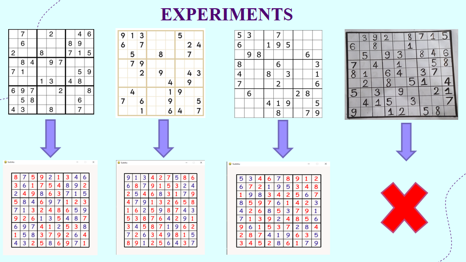

# Realtime 9x9 Sudoku Solver

## Project Description
This is a Computer Vision-based project used for solving 9x9 Sudoku table in Realtime.\
The model's strucutre is defined in the "Realtime_Sudoku_Solver.ipynb" jupyter notebook, using Tensorflow.Keras module.\
Then the model's weights is loaded using pre-trained model "digitRecognition.h5".

## Instructions to use 9x9 Sudoku Solver
1. Run the "Realtime_Sudoku_Solver.ipynb" jupyter notebook.\
2. When the front camera pops up, clearly show the Sudoku table which needs to be solved to the camera.\
3. Waits for the Sudoku Solver then the Solution window will pop up.\
4. While the front camera is on, you can change different Sudoku tables and waits for the Solutions.\
5. Press 'q' on the keyboard to quit and the front camera is turned off.

**Notes**
Maybe due to the limitation of computational resources, the quality of the camera, the lighting of the video,.. this 9x9 Sudoku Solver only works with printed Sudoku tables.\
The hand written Sudoku tables cannot be recognized to be solved.

## Some experiments

